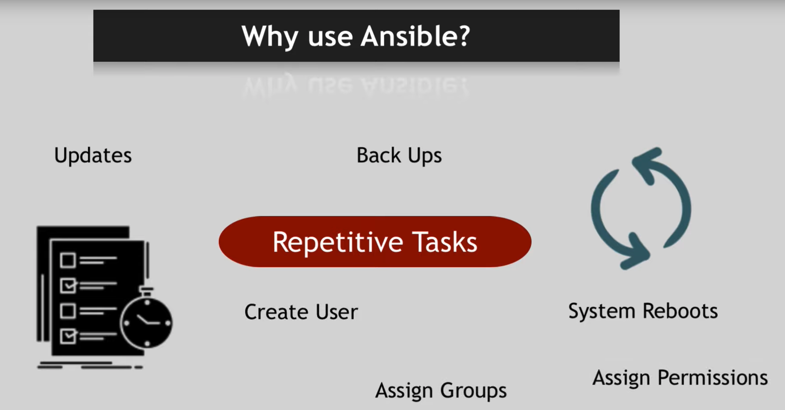

```{r setup, include=FALSE}
knitr::opts_chunk$set(echo = TRUE)
```

<center> <h1> Intro to Ansible </h1> 

</center>
<center> <h2>*Subtitle*</h2> </center>
<p>
&nbsp;
&nbsp;
</p>

 [**Rebecca Lange**](mailto:rebecca.lange@curtin.edu.au)
 
**Astronomy Data And Computing Services & Curtin Institute for Computation**

```{r, echo=FALSE, results='asis'} 
cat(paste("updated:", format(Sys.time(), '%d/%m/%Y')))
```

???

"color:#2e96c6" - CIC


???

Presenter notes go here

---
class: inverse, center, middle

# Outline

Intro to Ansible 

Concepts

How To Examples

Testing & Troubleshooting

Demo & Code-Along

Helpful Resources

---
class: inverse, center, middle

# Introduction to Ansible

---
class: middle

> _Ansible_ is an **agentless automation tool** that you install on a control node. From the control node, _Ansible_ manages machines and other devices remotely (by default, over the **SSH** protocol). <small><sup>1</sup></small>

> It uses a very simple language (**YAML**, in the form of Ansible Playbooks) that allows you to describe your automation jobs in a way that approaches plain English.<small><sup>2</sup></small>

> One of Ansible’s greatest strengths is its ability to **run regular shell commands verbatim**, so you can take existing scripts and commands and work on converting them into idempotent playbooks as time allows.<small><sup>3</sup></small>


.footnote[<small><sup>1</sup> [Installing Ansible](https://docs.ansible.com/ansible/latest/installation_guide/intro_installation.html)</br>
<sup>2</sup> [Ansible Overview](https://www.ansible.com/overview/how-ansible-works)</br>
<sup>3</sup> [Ansible for DevOps book](https://www.ansiblefordevops.com/)
</small>]


???

Ansible is an agentless automation tool which remotely manages machines over the ssh protocol.
Ansible uses YAML in its playbook, making it easy to describe your automation jobs.
It is easy to get started with Ansible since you can regular shell commands, so you can take existing scripts and convert them step by step.

> Ansible is a radically simple **IT automation engine** that automates cloud provisioning, configuration management, application deployment, intra-service orchestration, and many other IT needs.<small><sup>2</sup></small>

> It uses **no agents and no additional custom security infrastructure**, so it's easy to deploy - and most importantly, it uses a very simple language (**YAML**, in the form of Ansible Playbooks) that allow you to describe your automation jobs in a way that approaches plain English.<small><sup>2</sup></small>

<small><sup>2</sup> [Ansible Overview](https://www.ansible.com/overview/how-ansible-works)</small>

---
class: inverse, center, middle

## Ansible use cases


---

.left[]

.right[]

.footnote[<small>Source: [Youtube - What is Ansible - TechWorld with Nana](https://www.youtube.com/watch?v=1id6ERvfozo)</small>]

???

On snowflakes and shell scripts

Many developers and system administrators manage servers by **logging into them via SSH, making changes, and logging off**. Some of these changes would be documented, some would not. 

If an admin needed to make the same change to **many servers** (for example, changing one value in a config file), the admin would **manually log into each server** and repeatedly make this change.

[from Ansible for DevOps]

This raises the risk of introducing errors

Ansible lets you automate these repetitive tasks, like <see slide>, and in the form of playbooks also documents your workflow.

**Idempotence** is the ability to run an operation which produces the same
result whether run once or multiple times

---
class: middle


.footnote[See https://www.ansible.com/use-cases]

???

**Provisioning** - make sure a server, VM, computer is set up using required OS and packages

**Configuration Management** - check package/OS/application status and run required updates

**Application Deployment** - configure target VM/server/computer and copy required files/software, and check deployement success.

**Continuous Deployment** - combine with a continuous integration (CI) system to deploy a staging env; a production env on succesfully passed tests, check out from version control, CI server or package mirror.

**Security** - configure security details on control node and embed into all manage nodes automatically to investigate and respond to threats across all nodes.

**Orchestration** - manage multiple nodes and make sure front/backend services, databases, storage, etc are configured properly and in the correct order to run your service


See https://www.ansible.com/use-cases

---
class: middle

## How Ansible works


???

from the control/management node Ansible takes
- instructions in a playbook
- inventory of hosts
and then 
- ssh into each host 
- carrying out the specified tasks

---

class: inverse, center, middle

# Concepts

---
class: middle

**Control Node**: The machine where Ansible is installed, responsible for running the provisioning on the servers you are managing.

**Managed Node**: The machine(s) on which plays are executed.

**Inventory**: A file containing information about the managed servers.

**Playbook**: Your "instruction manual". The entry point for Ansible provisioning, where the automation is defined through tasks using YAML format. 

**Ansible Tower**: A web-based solution for managing your organization with a very easy user interface that provides a dashboard with state summaries of all the hosts, allows quick deployments, and monitors all configurations.

**Ansible Galaxy**: A repository for Ansible Roles that are available to drop directly into your Playbooks to streamline your automation projects.


---
class: middle

**Task**: A block that defines a single procedure to be executed, e.g. Install a package.

**Module**: Modules are "tools in the toolkit" and execute code (e.g. python, shell, etc) which gets pushed out to the managed nodes. Ansible has a multitude of built-in modules, but you can also create custom ones.
 
 **Role**: Roles are sets of Ansible defaults, files, tasks, templates, variables, and other Ansible components that work together and are saved in a named directory structure.

**Play**: A provisioning executed from start to finish is called a play. In simple words, execution of a playbook is called a play.

**Facts**: Global variables containing information about the system, like network interfaces or operating system.

**Handlers**: Used to trigger service status changes, like restarting or stopping.

???

https://www.edureka.co/blog/what-is-ansible/#why_do_we_need_ansible

https://dzone.com/articles/getting-started-with-ansible-tower-hands-on

https://www.redhat.com/sysadmin/ansible-galaxy-intro

---

# How to write Playbooks and Inventories

Playbooks are written in **YAML**

They execute specified **Tasks** in sequence, invoking **Ansible modules**.

The tasks are run on the **managed nodes** specified in the **inventory**.

Ansible uses **Jinja2 templating** to enable dynamic expressions and access to variables

---
class: middle

## Playbook Example 1


???

- the `name` field is human readable comments (optional) -> this will be printed as output when the playbook runs
- `host` specifies which host group is targeted, the group is specified in the inventory
- `vars` can be specified at the beginning of the playbook, on the command line, separate file
  - environment variables -> e.g. bash profile
- `remote_user` identity which will perform the tasks, could be just one or multiple, or different identity for different tasks
  - privilege escalation -> become: true 
- work gets done in `modules` with `key=value` format
- [including and importing](https://docs.ansible.com/ansible/latest/user_guide/playbooks_reuse.html#playbooks-reuse), dynamic vs static

---
class: middle

## Playbook Example 2


???

- `handlers` are tasks that are referenced globaly by a unique name
  - only get run when they are `notified`
  - only run after all other plays in a playbook are run -> even if they are called several times they will only be run once at the end

---
class: middle

## YAML syntax tips
.pull-left[

]
.pull-right[

]

???

```{bash eval=FALSE}
ansible-palybook playbook.yml --syntax-check
```

---

## Inventory Example

The inventory file can be in one of many formats, for example INI:


???

- hosts can be grouped -> [group-name]
- you can specify numeric or alphabetical ranges, 
  - leading zeros can be included, 
  - ranges are inclusive
- hosts can be aliased
- you can specify connection type, and user on per-host basis
- if you run on a non standard ssh port, specify after hostname with colon

---
class: inverse, center, middle

# Testing & Troubleshooting


???

image from Ansible for DevOps book, Jeff Geerling
---

### Linters and syntax checking

Some common errors in playbooks can arise from **yaml syntax issues**, like too many whitespaces.

[`yamllint`](https://yamllint.readthedocs.io/en/stable/) is a YAML lint tool installable via `pip`, once  installed it can be run on any YAML file in the current directory by passing the path:

```{bash eval=FALSE}
pip3 install yamllint

# to run yamllint on all YAML files in the current directory 
yamllint .
```

???

- it is important to follow a specific style:
  - it can help prevent mistakes
  - makes it easier to read files/playbooks

---

### Linters and syntax checking

Ansible also has inbuilt syntax checking.

Executing a playbook with `--syntax-check` will not run the plays, instead Asnible checks that everything in the playbook can be (statically*) loaded without fatal errors.

```{bash eval=FALSE}
ansible-playbook playbook.yml --syntax-check
```

Combining `yamllint` and `--syntax-check` should form your basic CI tests.

.footnote[*dynamic includes and variables can not be validated with `--syntax-check`]

???

- syntax check will highlight if you are
  - missing task files
  - misspelled module names
  - supply invalid parameters

---

### Linters and syntax checking

`ansible-lint` can help improve ansible specific style issues.

```{bash eval=FALSE}
pip3 install ansible-lint

#to run on a playbook
ansible-lint main.yml

```


**TO DO** examples

p374 (349)
---

### Molecule

**TO DO**

---
class: inverse, center, middle

# Demo & Code-Along

---

## Requirements

**Control Node**
- Python > v3.5, 
  - ansible-core 2.12 and Ansible 5.0.0 will require Python 3.8
- Windows is _not_ supported for the control node
- YAML
- SSH and SFTP

**Managed Node**
- SSH and SFTP
  - if SFTP not available -> switch to SCP
- Python if possible

**Documentation** 
 - https://docs.ansible.com/
 - [Installation guide](https://docs.ansible.com/ansible/latest/installation_guide/intro_installation.html#) 


---

## Installation

`ansible`
- Includes the Ansible language and runtime plus a range of community curated Collections
- Install the latest release with your OS package manager or with `pip`

`ansible-core`
- Contains the Ansible language, runtime, and a short list of core modules and other plugins
- Install with `pip` or from source from the ansible/ansible GitHub repository (development version)

```{bash, eval=F}
# to install ansible
python -m pip install --user ansible

# to install ansible-core
pip install ansible-core

# packages used for examples on Google Cloud
pip install requests google-auth
```

???

check that `~/.local/bin/` is added to the `$PATH`

one can add arg complete

```{bash, eval=F}
python -m pip install argcomplete
sudo activate-global-python-argcomplete
```

---

## Set Up

Create a `hosts.ini` file listing the hosts you want to use during this exercise. My file looks like this:


configure your default ansible parameters in `ansible.cfg` and save it in the root directory of your project. Mine reads:

```
[defaults]
inventory=hosts.ini
```

---
class: inverse, middle

## Example 1 - Remote Monitoring

- Ping hosts
- Check login works
- Collect system info

---
class: middle 

### Ping/Check login works - ad hoc

The ansible `ping` module verifies the ability to login and that a usable Python is configured on the managed node, it is not an ICMP ping.

```{bash, eval=F}
ansible -i [host filename] [group] -m ping -u [username]\
--private-key=[file/location]
```


???

ICMP - Internet Control Message Protocol 

```{bash, eval=F}
ansible -i hosts.ini gcs -m ping -u rebecca_lange_computation_org_au --private-key=~/.ssh/gcloud
```

---
class: middle 

### Ping/Check login works - ad hoc
The `wait_for_connection` module waits until a remote system is reachable/usable and will retry the connecting after a specified amount of time.


```{bash, eval=F}
ansible -i [host filename] [group] -m wait_for_connection
```


???
```{bash, eval=F}
ansible -i hosts.ini ozstar -m wait_for_connection
```

---

### Ping/Check login works - playbook


---
class: middle 

### Collect system info - ad hoc

```{bash, eval=F}
ansible -i [host filename] [group] -a "hostname"

# if the host file name has been set in the ansible.cfg it can be omitted from the command
ansible [group] -a "df -h" 
ansible [group] -a "date"
```


---

# TO DO

check server status

`check_state.yml`


---
class: inverse, middle

## Example 2 - Remote Configuration

- OS package updates 
- Modify/Upload config files and service scripts
- Restart services

---
class: middle

### Set Up Vagrant VMs

For this we will set up three Vagrant VMs so that we can test our configurations without breaking our production servers.
<small>
1. Download and install [Vagrant](https://www.vagrantup.com/downloads) and [VirtualBox](https://www.virtualbox.org/wiki/Downloads) (when installing, make sure the command line tools are installed, so Vagrant works with it)
2. Create a new folder somewhere on your hard drive where you will keep your Vagrantfile and provisioning instructions, e.g. `~/vagrant_vms/`, navigate to this folder in your Terminal.
3. Copy the `Vagrantfile` from the `Example 2` folder in the github repo into the folder you created in step 2.
4. The file defines three servers, to boot your CentOS servers run: 
```
vagrant up
```

Note: [HashiCorp’s Vagrant Cloud](https://app.vagrantup.com/boxes/search) has a comprehensive list of different pre-made Linux boxes. You can add and initiate these using:
```
vagrant box add [user/boxname]
vagrant init [user/boxname]
 ```
</small>

???

issues with mac: https://medium.com/@Aenon/mac-virtualbox-kernel-driver-error-df39e7e10cd8

---

### Check ansible.cfg and hosts.ini

.pull-left[Navigate back to your `Example 2` working directory and check your `ansible.cfg`.
It should read 

```
[defaults]
inventory=hosts.ini
```
]

.pull-right[
also check your `hosts.ini` file

]

Check out Chapter 3 of Ansible for DevOps for ad hoc ocmmands for orchestration.

---

### 
- OS package updates 
- Modify/Upload config files and service scripts
- Restart services
---
class: inverse, middle

## Example 3 - Automated Software Update

- pull updates from remote server
- back-up files on controlled node

---
class: inverse, center, middle

# Questions & Helpful Resources


---

## Links

**Jeff Geerling's 'Ansible for DevOps':**
- [Ansible for DevOps book](https://www.ansiblefordevops.com/)
- [Ansible 101 on youtube](https://www.youtube.com/playlist?list=PL2_OBreMn7FqZkvMYt6ATmgC0KAGGJNAN)
- [Github repo](https://github.com/geerlingguy/ansible-for-devops) of examples from the book

**Ansible Documentation:**
- [Installation Guide](https://docs.ansible.com/ansible/latest/installation_guide/index.html_) and [Getting Started with Ansible](https://www.ansible.com/resources/get-started)
- [Intro to Playbooks](https://docs.ansible.com/ansible/latest/user_guide/playbooks_intro.html#) and [Ansible Example Playbooks on GitHub](https://github.com/ansible/ansible-examples)
- [Ansible Glossary](https://docs.ansible.com/ansible/latest/reference_appendices/glossary.html) 

**Other**
- [Molecule](https://molecule.readthedocs.io/en/latest/) and [Testing your Ansible roles with Molecule](https://www.jeffgeerling.com/blog/2018/testing-your-ansible-roles-molecule)
- [Ansible Lint](https://ansible-lint.readthedocs.io/en/latest/)
- [yamllint](https://yamllint.readthedocs.io/en/stable/)

- [What is Ansible](https://www.youtube.com/watch?v=1id6ERvfozo) - TechWorld with Nana
- [The Bullhorn](https://us19.campaign- archive.com/home/?u=56d874e027110e35dea0e03c1&id=d6635f5420) - Ansible’s official newsletter.
- [Ansible Mailing List on Google Groups](https://groups.google.com/forum/#!forum/ansible-project)
- [Ansible Blog](https://www.ansible.com/blog)

- [Ansible Playbook Examples](https://www.middlewareinventory.com/blog/ansible-playbook-example/)

